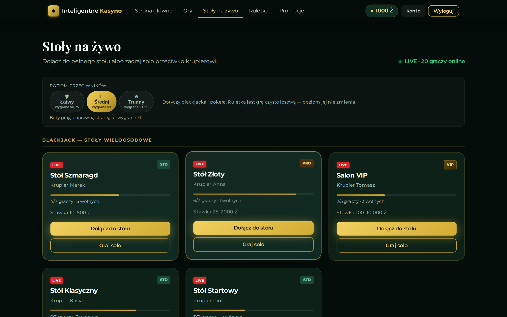
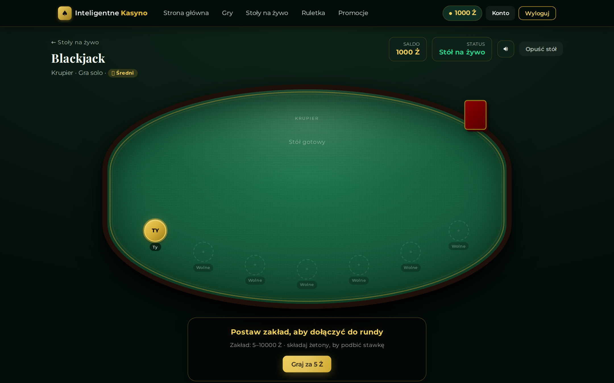
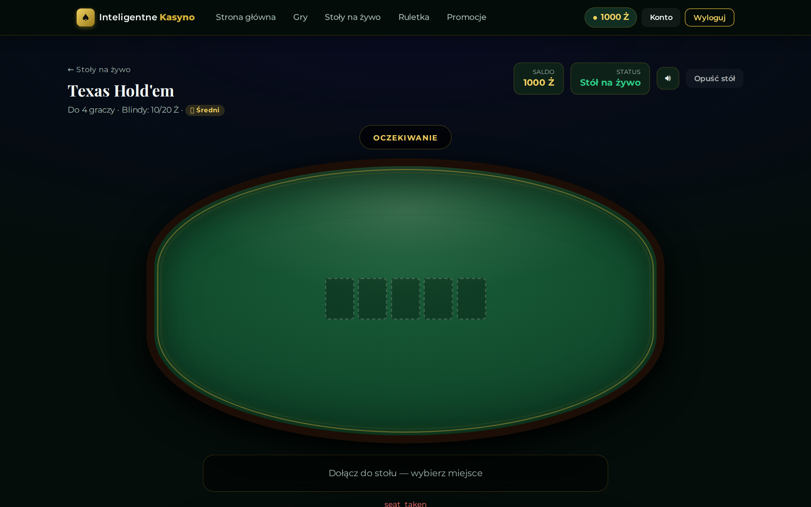
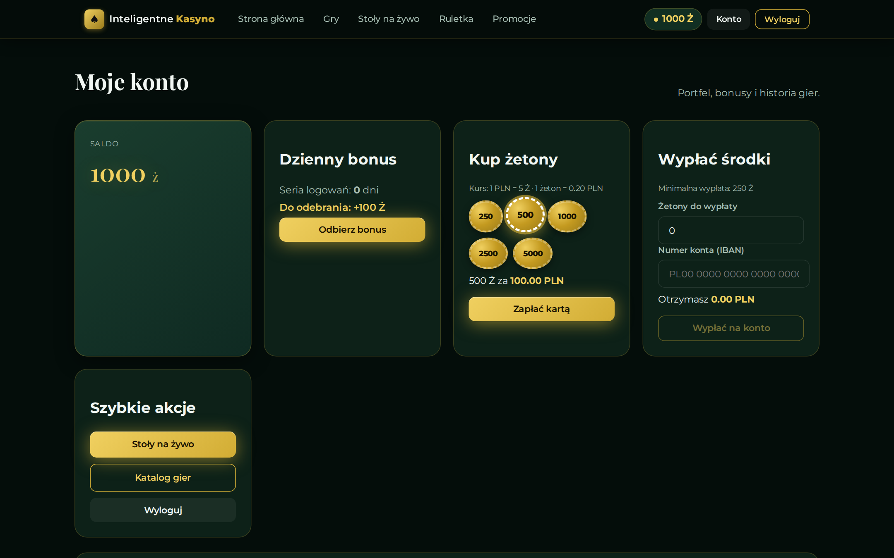
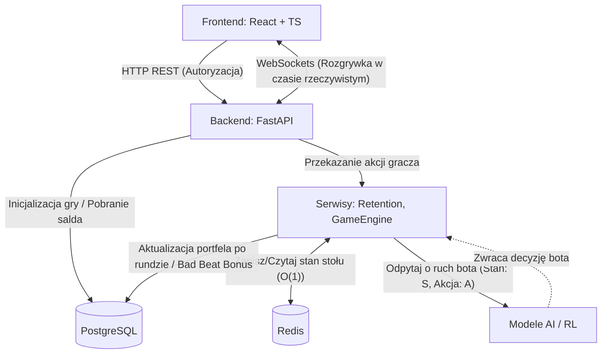
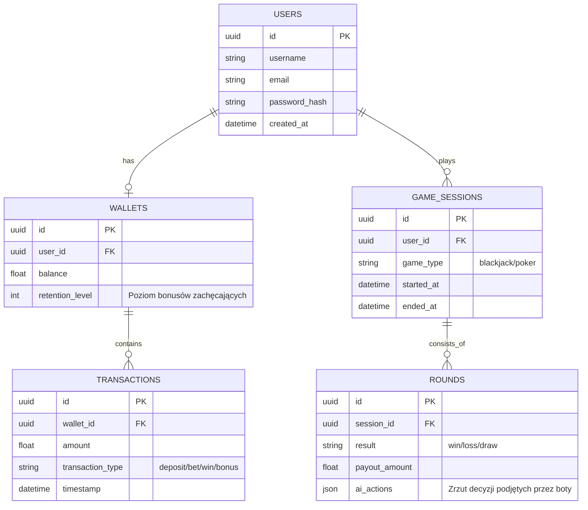
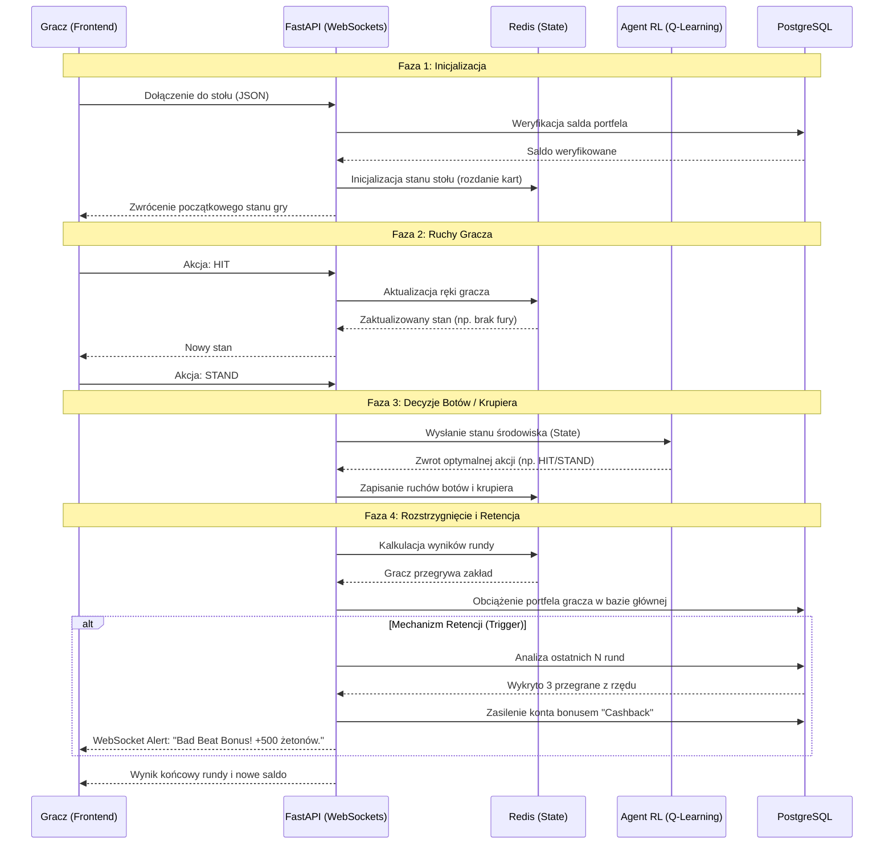
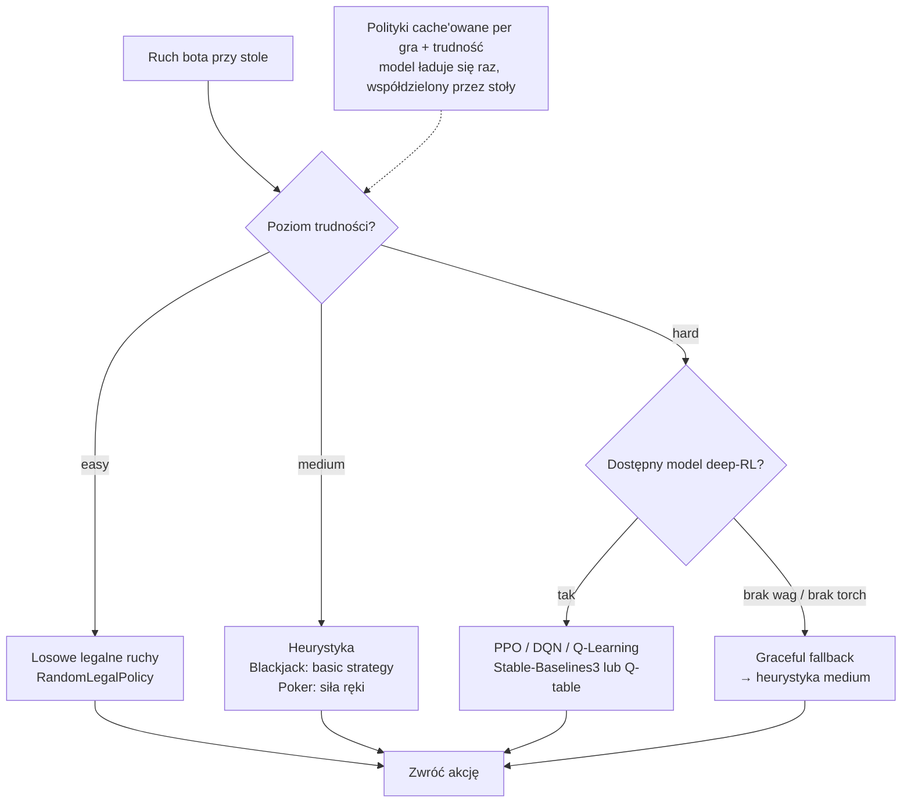

# 🎰 Inteligentne Kasyno

> Webowa platforma kasyna, w której grasz w **blackjacka, pokera (Texas Hold'em) i ruletkę** przeciwko agentom AI trenowanym metodami uczenia ze wzmocnieniem (Reinforcement Learning).

[](https://github.com/JanBanasik/Casino/actions/workflows/ci.yml)
[](LICENSE)


**🔗 Live demo:** **https://kasyno-jb-frontend.onrender.com**

> ℹ️ Hostowane na darmowym tierze Render — po dłuższej bezczynności pierwsze wejście budzi serwer (~30–60 s zimnego startu). Odśwież po chwili, jeśli strona ładuje się długo.

## Zrzuty ekranu

| Lobby | Blackjack |
| :---: | :---: |
|  |  |
| **Poker (Texas Hold'em)** | **Konto i płatności** |
|  |  |

> 📷 _Wrzuć zrzuty ekranu do katalogu `docs/screenshots/` pod nazwami `lobby.png`, `blackjack.png`, `poker.png`, `konto-platnosci.png`, a pojawią się powyżej._

## 1. Wstęp i Cel Projektu

„Inteligentne Kasyno” to webowa platforma gier hazardowych, w której użytkownik rywalizuje z agentami sztucznej inteligencji, trenowanymi metodami uczenia ze wzmocnieniem (Reinforcement Learning - RL).

Celem projektu jest zaprezentowanie skuteczności algorytmów takich jak Q-Learning (i opcjonalnie PPO) w środowisku gier o niepełnej informacji oraz implementacja mechanizmów retencji użytkownika. Projekt jest przygotowany do łatwego wdrożenia (high-performance) dzięki nowoczesnej architekturze.

### Dokumentacja uzupełniająca

- Architektura MVP backendu: [docs/backend-mvp-architecture.md](docs/backend-mvp-architecture.md)
- Następne kroki (backlog): [docs/next-steps.md](docs/next-steps.md)

## 2. Stos Technologiczny i Uzasadnienie

### Backend

- FastAPI: Asynchroniczny framework webowy dla Pythona. Idealny do budowy API i obsługi WebSockets. Oferuje wysoką wydajność i natywną integrację z bibliotekami ML (PyTorch, Numpy).
- Python: Główny język logiki biznesowej, silnika gier oraz modeli sztucznej inteligencji.
- Pydantic: Zapewnienie silnego typowania i walidacji danych wejściowych z frontendu.

### Bazy Danych i Pamięć Podręczna

- PostgreSQL: Relacyjna baza danych. Służy do trwałego przechowywania krytycznych informacji: kont użytkowników, stanu wirtualnych portfeli, historii transakcji oraz logów sesji. Zapewnia zgodność ACID.
- Redis: Pamięć in-memory działająca jako bufor i magazyn szybkiego dostępu (cache). Przechowuje "gorący" stan aktywnych stołów do gry (np. aktualnie rozdane karty), co zapobiega przeciążeniu PostgreSQL przy każdym ruchu.

### Frontend

- React + TypeScript + Vite: Nowoczesne i wydajne środowisko do budowy interfejsów użytkownika. TypeScript zapewnia zgodność typów między frontendem a backendem (FastAPI + Pydantic).

### Inne

- WebSockets: Dwukierunkowa, ciągła komunikacja między klientem a serwerem, kluczowa dla płynności rozgrywki (szczególnie w grach wieloosobowych).
- Reinforcement Learning (Q-Learning / PPO): Algorytmy odpowiadające za "inteligencję" botów. Q-Learning (tabelaryczny) dla prostszych stanów, PPO (Deep RL) dla złożonych środowisk (Poker).

## 3. Struktura Katalogów Projektu

Zastosowano podział na warstwy (Clean Architecture), izolując logikę gier od frameworka webowego.

```text
/intelligent-casino
├── /backend                 # Serce aplikacji
│   ├── /app
│   │   ├── /api             # Endpointy REST i obsługa WebSockets
│   │   ├── /core            # Konfiguracja (Auth, zmienne środowiskowe)
│   │   ├── /db              # Modele ORM (PostgreSQL) i klient Redis
│   │   ├── /engine          # CZYSTA LOGIKA GIER (niezależna od API/DB)
│   │   │   ├── blackjack.py
│   │   │   └── poker.py
│   │   ├── /ml_inference    # Ładowanie wytrenowanych modeli i obsługa zapytań
│   │   ├── /services        # Logika biznesowa (RetentionService, obsługa rundy)
│   │   └── main.py          # Entry point aplikacji
│   ├── requirements.txt
│   └── Dockerfile
│
├── /frontend                # Interfejs użytkownika
│   ├── /src
│   │   ├── /components      # UI, wizualizacja stołu, kart
│   │   ├── /hooks           # Hooki (np. useWebSocket)
│   │   ├── /pages           # Główne ekrany (Dashboard, GameTable)
│   │   ├── /services        # Zapytania API
│   │   └── /types           # Interfejsy TypeScript (zgodne z backendem)
│   ├── package.json
│   └── Dockerfile
│
└── /rl_training             # Osobne środowisko do trenowania agentów
    ├── /envs                # Środowiska symulacyjne
    ├── /scripts             # Skrypty trenujące
    └── /saved_models        # Wyeksportowane wagi modeli (np. .pkl)
```

## 4. Architektura Systemu

### 4.1 C4 Component Diagram

Schemat ilustruje przepływ danych i rolę Redisa jako warstwy optymalizacyjnej.



### 4.2 Schemat Bazy Danych (ERD)

Struktura relacyjna w PostgreSQL, przygotowana na system transakcyjny (portfel) oraz śledzenie statystyk.



### 4.3 Przepływ Komunikacji Real-Time (Sequence Diagram)

Ilustracja obsługi pojedynczej rundy w Blackjacka z uwzględnieniem mechanizmu retencji.



### 4.4 Wybór polityki bota wg poziomu trudności

Serce „inteligencji” kasyna. Każdy stół ma poziom trudności, a rejestr
(`backend/app/ml_inference/registry.py`) mapuje go na konkretną politykę bota —
z **miękkim fallbackiem**: gdy brak wag modelu lub PyTorcha, bot schodzi do
prostszej strategii i gra dalej (aplikacja nigdy nie zależy twardo od ML).



## 5. System Retencji (RetentionService)

Mechanizm behawioralny mający na celu utrzymanie zaangażowania gracza, zaimplementowany jako system event-driven.

Logika działania:

- Monitorowanie (Wyzwalacz): Po każdej zakończonej rundzie Game Engine wysyła zdarzenie do RetentionService.
- Analiza: Serwis sprawdza warunki, np. utrata ponad 30% początkowego salda w 5 minut lub seria 3 przegranych pod rząd.
- Reakcja (Akcja):
  - Wysłanie powiadomienia WebSocket ("Nie martw się, to tylko zła passa!").
  - Przyznanie nagrody pocieszenia (dodatkowe żetony w PostgreSQL).
- Nice to Have: Dynamiczne obniżenie poziomu trudności botów przy stole, zastępując wytrenowanego agenta modelem z wyższym współczynnikiem losowości.

## 6. Uruchomienie (dev i produkcja)

### Wymagania

- Docker + Docker Compose
- [uv](https://docs.astral.sh/uv/) (Python)
- Node.js 22+ (frontend dev)

### Lokalnie (development)

```bash
# 1. Infrastruktura (Postgres :15432, Redis :16379)
make docker-up

# 2. Backend
cp backend/.env.example backend/.env   # ustaw JWT_SECRET_KEY
make install
make migrate
make dev                               # API http://localhost:8000

# 3. Frontend (osobny terminal)
make frontend-install
make frontend-dev                      # UI http://localhost:5173
```

**pgAdmin:** host `localhost`, port `15432`, user/db/password `casino`.

### WebSocket (produkcja-ready)

Token JWT **nie** trafia do URL. Flow:

1. `POST /api/sessions/{id}/ws-ticket` (Bearer JWT) → krótkotrwały ticket (Redis, 120s, jednorazowy)
2. `ws://host/ws/tables/{table_id}` — bez query string
3. Pierwsza wiadomość: `{"type":"auth","ticket":"..."}` → `{"type":"auth_ok"}`

### Produkcja (Docker Compose)

```bash
cp .env.example .env                       # uzupełnij JWT_SECRET_KEY (openssl rand -hex 32)
make prod-up                               # frontend http://localhost:8080
make prod-down
```

Stack: `postgres`, `redis`, `backend`, `frontend` (nginx proxy dla `/api` i `/ws`).

### Testy

```bash
make lint
make test
```

## 7. Płatności (Stripe)

Doładowanie wirtualnych żetonów odbywa się przez **Stripe Checkout**.

- **Tryb symulacji (domyślny, bez kluczy)** — gdy `STRIPE_SECRET_KEY` jest pusty,
  żetony są dopisywane natychmiast, bez realnego obciążenia. Idealne na demo i dev.
- **Tryb realny** — ustaw klucze testowe Stripe w `.env`. Doładowanie tworzy sesję
  Checkout, a fulfillment (dopisanie żetonów) realizuje webhook
  `checkout.session.completed` na `POST /api/payments/webhook`.
- **Webhook lokalnie:**
  ```bash
  stripe listen --forward-to localhost:8000/api/payments/webhook
  # sekret z tej komendy → STRIPE_WEBHOOK_SECRET w backend/.env
  ```
- Kurs wymiany i waluta są konfigurowalne (`CHIPS_PER_CURRENCY_UNIT`, `PAYMENT_CURRENCY`).

> 💳 Do testów użyj karty Stripe `4242 4242 4242 4242`, dowolna przyszła data i CVC.

## 8. Wdrożenie (Render)

Cały stos stawia się z jednego blueprintu **[`render.yaml`](render.yaml)** (darmowy tier).

- **4 zasoby:** `kasyno-jb-frontend` (nginx + SPA), `kasyno-jb-backend` (FastAPI),
  `kasyno-jb-db` (PostgreSQL), `kasyno-jb-redis` (Key Value) — wszystkie w jednym
  regionie (wewnętrzny hostname bazy rozwiązuje się tylko w obrębie regionu).
- **Migracje w starcie** — kontener backendu robi `alembic upgrade head`, po czym
  wstaje na `$PORT` (komenda jest w `backend/Dockerfile`, nie w `render.yaml`).
- **Frontend jako proxy** — nginx przekierowuje `/api` i `/ws` do backendu (ten sam
  origin), URL backendu wstrzykiwany przez `BACKEND_URL` (envsubst).
- Sekrety Stripe ustawia się ręcznie w panelu Render (sync: false) — patrz
  [`.env.example`](.env.example).

Deploy: Render Dashboard → **New → Blueprint** → wskaż to repo → **Apply**.

## 9. Zespół

| Autor | GitHub |
| --- | --- |
| Jan Banasik | [@JanBanasik](https://github.com/JanBanasik) |
| Patrick Bajorski | [@bajorski16](https://github.com/bajorski16) |
| Gabriel Filipowicz | [@g13filip](https://github.com/g13filip) |
| Antoni Pater | [@antoniopater](https://github.com/antoniopater) |

## 10. Licencja

Projekt udostępniony na licencji **MIT** — szczegóły w pliku [LICENSE](LICENSE).