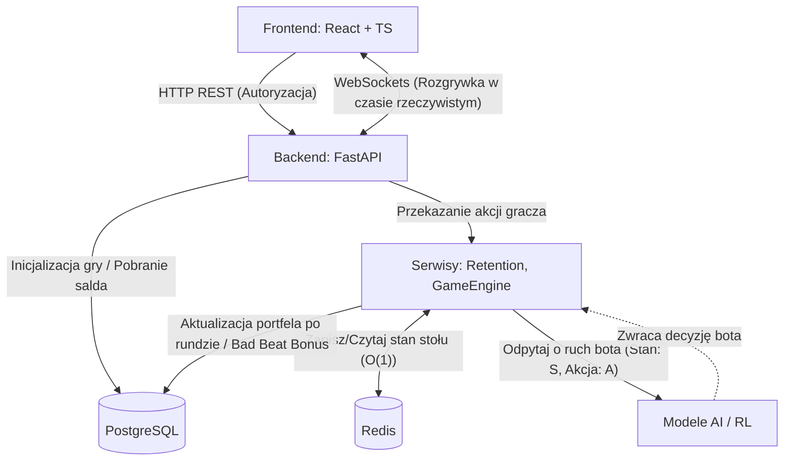
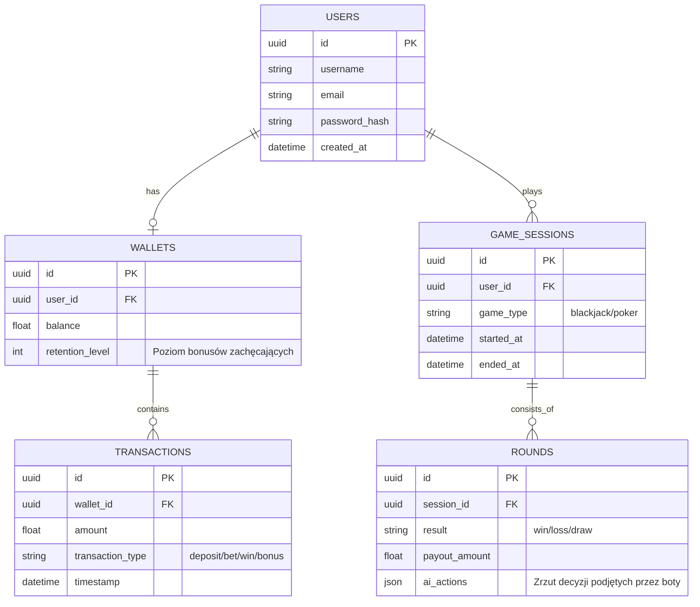
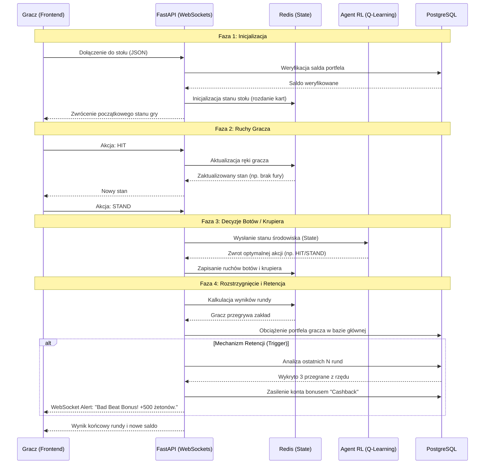

# Inteligentne Kasyno: Platforma gier oparta na agentach RL

## 1. Wstęp i Cel Projektu

„Inteligentne Kasyno” to webowa platforma gier hazardowych, w której użytkownik rywalizuje z agentami sztucznej inteligencji, trenowanymi metodami uczenia ze wzmocnieniem (Reinforcement Learning - RL).

Celem projektu jest zaprezentowanie skuteczności algorytmów takich jak Q-Learning (i opcjonalnie PPO) w środowisku gier o niepełnej informacji oraz implementacja mechanizmów retencji użytkownika. Projekt jest przygotowany do łatwego wdrożenia (high-performance) dzięki nowoczesnej architekturze.

## 2. Stos Technologiczny i Uzasadnienie

### Backend

- FastAPI: Asynchroniczny framework webowy dla Pythona. Idealny do budowy API i obsługi WebSockets. Oferuje wysoką wydajność i natywną integrację z bibliotekami ML (PyTorch, Numpy).
- Python: Główny język logiki biznesowej, silnika gier oraz modeli sztucznej inteligencji.
- Pydantic: Zapewnienie silnego typowania i walidacji danych wejściowych z frontendu.

### Bazy Danych i Pamięć Podręczna

- PostgreSQL: Relacyjna baza danych. Służy do trwałego przechowywania krytycznych informacji: kont użytkowników, stanu wirtualnych portfeli, historii transakcji oraz logów sesji. Zapewnia zgodność ACID.
- Redis: Pamięć in-memory działająca jako bufor i magazyn szybkiego dostępu (cache). Przechowuje "gorący" stan aktywnych stołów do gry (np. aktualnie rozdane karty), co zapobiega przeciążeniu PostgreSQL przy każdym ruchu.

### Frontend

- React + TypeScript + Vite: Nowoczesne i wydajne środowisko do budowy interfejsów użytkownika. TypeScript zapewnia zgodność typów między frontendem a backendem (FastAPI + Pydantic).

### Inne

- WebSockets: Dwukierunkowa, ciągła komunikacja między klientem a serwerem, kluczowa dla płynności rozgrywki (szczególnie w grach wieloosobowych).
- Reinforcement Learning (Q-Learning / PPO): Algorytmy odpowiadające za "inteligencję" botów. Q-Learning (tabelaryczny) dla prostszych stanów, PPO (Deep RL) dla złożonych środowisk (Poker).

## 3. Struktura Katalogów Projektu

Zastosowano podział na warstwy (Clean Architecture), izolując logikę gier od frameworka webowego.

```text
/intelligent-casino
├── /backend                 # Serce aplikacji
│   ├── /app
│   │   ├── /api             # Endpointy REST i obsługa WebSockets
│   │   ├── /core            # Konfiguracja (Auth, zmienne środowiskowe)
│   │   ├── /db              # Modele ORM (PostgreSQL) i klient Redis
│   │   ├── /engine          # CZYSTA LOGIKA GIER (niezależna od API/DB)
│   │   │   ├── blackjack.py
│   │   │   └── poker.py
│   │   ├── /ml_inference    # Ładowanie wytrenowanych modeli i obsługa zapytań
│   │   ├── /services        # Logika biznesowa (RetentionService, obsługa rundy)
│   │   └── main.py          # Entry point aplikacji
│   ├── requirements.txt
│   └── Dockerfile
│
├── /frontend                # Interfejs użytkownika
│   ├── /src
│   │   ├── /components      # UI, wizualizacja stołu, kart
│   │   ├── /hooks           # Hooki (np. useWebSocket)
│   │   ├── /pages           # Główne ekrany (Dashboard, GameTable)
│   │   ├── /services        # Zapytania API
│   │   └── /types           # Interfejsy TypeScript (zgodne z backendem)
│   ├── package.json
│   └── Dockerfile
│
└── /rl_training             # Osobne środowisko do trenowania agentów
    ├── /envs                # Środowiska symulacyjne
    ├── /scripts             # Skrypty trenujące
    └── /saved_models        # Wyeksportowane wagi modeli (np. .pkl)
```

## 4. Architektura Systemu

### 4.1 C4 Component Diagram

Schemat ilustruje przepływ danych i rolę Redisa jako warstwy optymalizacyjnej.



### 4.2 Schemat Bazy Danych (ERD)

Struktura relacyjna w PostgreSQL, przygotowana na system transakcyjny (portfel) oraz śledzenie statystyk.



### 4.3 Przepływ Komunikacji Real-Time (Sequence Diagram)

Ilustracja obsługi pojedynczej rundy w Blackjacka z uwzględnieniem mechanizmu retencji.



## 5. System Retencji (RetentionService)

Mechanizm behawioralny mający na celu utrzymanie zaangażowania gracza, zaimplementowany jako system event-driven.

Logika działania:

- Monitorowanie (Wyzwalacz): Po każdej zakończonej rundzie Game Engine wysyła zdarzenie do RetentionService.
- Analiza: Serwis sprawdza warunki, np. utrata ponad 30% początkowego salda w 5 minut lub seria 3 przegranych pod rząd.
- Reakcja (Akcja):
  - Wysłanie powiadomienia WebSocket ("Nie martw się, to tylko zła passa!").
  - Przyznanie nagrody pocieszenia (dodatkowe żetony w PostgreSQL).
- Nice to Have: Dynamiczne obniżenie poziomu trudności botów przy stole, zastępując wytrenowanego agenta modelem z wyższym współczynnikiem losowości.