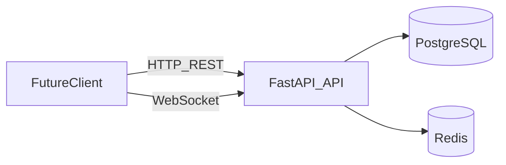
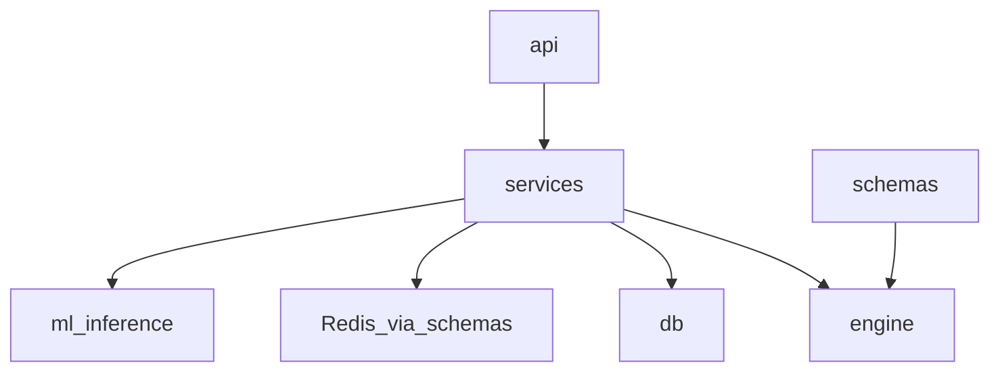
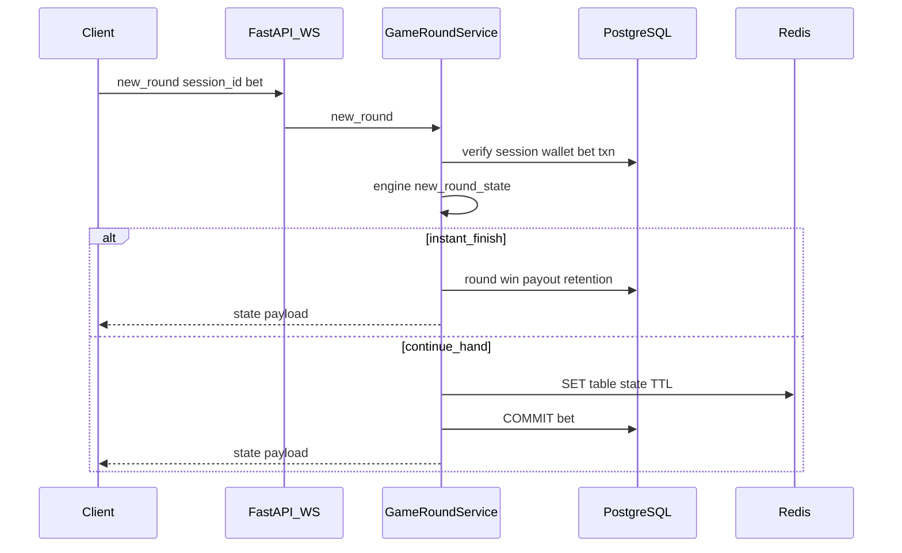

# Architektura MVP backendu

Ten dokument uzupełnia [README.md](../README.md) o widok wdrożeniowy i modułowy backendu FastAPI (stan na MVP).

## C4 — kontenery (MVP)

- **PostgreSQL**: użytkownicy, portfele, transakcje, sesje gier, rundy (w tym `ai_actions` jako JSON).
- **Redis**: gorący stan stołu pod kluczem `table:{table_id}:state` (TTL z konfiguracji).
- **REST**: `/api/health`, `/api/auth/*`, `/api/wallet/*`, `/api/sessions/*`, `POST /api/sessions/{id}/ws-ticket`.
- **WebSocket**: `/ws/tables/{table_id}` — auth przez pierwszą wiadomość `{"type":"auth","ticket":"..."}` (ticket z REST, TTL 120s, single-use w Redis).

## Moduły backendu

- **engine**: czysta logika Blackjacka (bez FastAPI).
- **services**: `WalletService`, `GameRoundService`, `RetentionService` (3 przegrane z rzędu → bonus).
- **ml_inference**: interfejs polityk bota; MVP — heurystyka krupiera w silniku + placeholder pod RL.
- **schemas**: `RedisTableState` — walidacja stanu zapisywanego w Redis.

## Sekwencja — nowa runda przez WebSocket

## Uwagi bezpieczeństwa

- JWT w nagłówku `Authorization` dla REST.
- WebSocket: krótkotrwałe bilety (`ws_ticket:{jti}`) w Redis zamiast JWT w query string — brak wycieku w logach proxy / historii przeglądarki.

## Porty developerskie (docker-compose)

Domyślnie Postgres nasłuchuje na hoście na porcie **15432**, Redis na **16379**, żeby uniknąć kolizji z lokalnymi usługami na 5432/6379.
